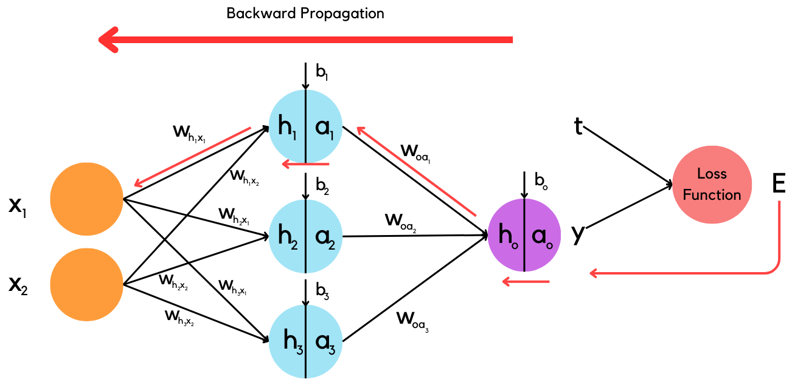
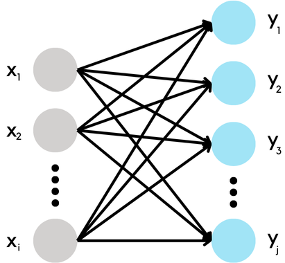

# Neural Network from scratch in C++

Welcome to the **Neural Network from Scratch in C++** project! This repository features a straightforward implementation of a neural network built entirely from the ground up using C++. Designed to engage AI and machine learning enthusiasts, this project provides a hands-on opportunity to explore the mathematical and programming principles behind neural networks. Whether you're a learner or an experienced developer, you'll gain deeper insights into the inner workings of neural networks and their underlying algorithms.

## Table of Contents

- [Concept & Intuition](#Concept-&-Intuition)
- [Core Components](#Core-Components)
  - [Fully-connected layer](#Fully-connected-layer)
  - [Activation Function](#Activation-Function)
  - [Loss Function](#Loss-Function)
  - [Gradient Descent](#Gradient-Descent)
- [Underlying Mathematics](#Underlying-Mathematics)
  - [Forward Propagation](#Forward-Propagation)
  - [Backward Propagation](#Backward-Propagation)
- [Breaking into Modules](#Breaking-into-Modules)
- [Implementation](#Implementation)
  - [Utility Function Implementation](#Utility-Function-Implementation)
  - [Activation Function Implementation](#Activation-Function-Implementation)
  - [Layers Implementation](#Layers-Implementation)
  - [Loss Function Implementation](#Loss-Function-Implementation)
  - [Neural Network Implementation](#Neural-Network-Implementation)
- [Example: XOR operation prediction](#Example-XOR-operation-prediction)
- [License](#License)
- [Contributing](#Contributing)
- [Author](#Author)

## Concept & Intuition

Have you ever wondered what enables humans to breathe, walk, make decisions, respond to stimuli, and ultimately think? The answer lies in the brain and central nervous system, which consists of billions of interconnected neurons. Similarly, artificial neural networks (ANNs) are computational models inspired by the structure of the biological brain and neurons. They consist of interconnected layers of artificial neurons that process information and learn from data, enabling the network to make decisions and predictions.

In this project, we aim to build a neural network from scratch using C++, demystifying the concepts and mathematics behind these models. By manually implementing each component, we gain a deeper understanding of how neural networks operate and how they learn from data.

## Core Components

### Fully-connected layer

The fully-connected layer is arguably one of the most vital constituents of any neural network. The main functionality of this layer is to apply an affine transformation on the incoming data. But what exactly is this fancy term called affine transformation? Simply put, it is just a linear transformation (transforming a vector by multiplying it with a matrix) with a translation (adding another vector to a transformed vector). Mathematically, we can describe the output of this fully-connected layer (or affine transformation) as:

```math
y = Wx + b
```

Where:

- $W$ represents the weight matrix (perform a linear transformation on $x$),
- $x$ is the input vector,
- $b$ is the bias vector (translate $x$),
- $y$ is the output vector.

Although this transformation process is essential for the neural network, it is still very lacking in terms of its power, especially for processing highly complex data. The reason is that the affine transformation operations such as scaling, rotation, and shearing even with the translation still cannot account for the nonlinearity. Why is that?

let's see an example. Suppose we have a neural network with solely 2 fully-connected layers, then we can write out the equation as follows:

```math
\begin{aligned}
h_1 = W_1x + b_1 \quad (1) \\
o = h_2 = W_2h_1 + b_2 \quad (2) \\
\end{aligned}
```

Then if we substitute (1) into (2), this is what we get:

```math
\begin{aligned}
o = W_2(W_1x + b_1) + b_2 \\
o = W_2W_1x + W_2b_1 + b_2 \\
\end{aligned}
```

After that, we can group $W_2W_1$ into a new weight matrix $W'$ and $W_2b_1 + b_2$ into a new bias $b'$. Therefore, we end up with:

```math
o = W'x + b'
```

As you can see, it looks just like another affine transformation, which implies that no matter how many layers you put into your network, without a nonlinearity, the network will not be capable of exerting any more complex processing aside from a mere affine transformation (you can consult this [video](https://www.youtube.com/watch?v=JtVRC4qwmqg) for more explanation). This is why the activation function needs to come into play.

### Activation Functions

An activation function in a neural network introduces non-linearity, allowing the model to learn and represent complex patterns in data. Without these non-linear functions, even a deep network would effectively behave like a shallow linear model, limiting its ability to capture intricate relationships. Here are some commonly used activation functions:

**Sigmoid Function**

The sigmoid function is a mathematical function with an S-shaped curve that transforms any real-valued input into a value between 0 and 1. This characteristic makes it particularly useful for applications requiring probabilities or binary classifications, as it compresses values into a range between 0 and 1.

```math
\sigma(x)= \frac {1}{1+e^{-x}}
```

**Rectified Linear Unit (ReLU)**

The Rectified Linear Unit (ReLU) function is both simple and effective. It outputs the input value directly if the input is positive, and zero if the input is negative. This straightforward approach introduces non-linearity into neural networks, allowing them to model complex patterns while remaining computationally efficient.

```math
ReLU(x) = max(0,x) = \begin{cases}
        x,&  \text{if } x > 0\\
        0,&   \text{otherwise}
\end{cases}
```

**Hyperbolic Tangent Function (Tanh)**

The tanh activation function, which stands for hyperbolic tangent, is a widely used non-linear function in neural networks. Like the sigmoid function, it features an S-shaped curve, but it maps input values to an output range of -1 to 1. This output range centers the data around zero, which can improve the performance and stability of the training process by ensuring more balanced gradients and faster convergence.

```math
tanh(x) = \frac{(e^x − e^{-x})}{(e^x + e^{-x})}
```

Now that we already laid some foundation of the neural network, from the fully-connected layer performing the affine transformation to the activation functions, which helps provide some nonlinearity, another question may arise: How can we obtain the optimal weight matrix and bias vector that will be used for an affine transformation? How can the neural network learn those values effectively?

Well, first things first, when learning anything, one of the most essential parts is the goal or objective that one wants to achieve. In the case of neural networks, it is to make a prediction that is as close to the target value as possible. As the guiding light for the learning process of neural networks, what we need is the loss function.

### Loss Functions

A loss function is a crucial component in a neural network that quantifies the difference between a model's predictions and the actual target values. It provides a numerical measure of how well the model is performing, guiding the optimization process by indicating how to adjust the model’s parameters to minimize errors. Essentially, the loss function acts as a feedback mechanism, helping to improve the accuracy of the model by minimizing the discrepancy between predicted and true outcomes. Some commonly used loss functions are:

**Mean Squared Error (MSE)**

Mean Squared Error (MSE) is a loss function widely used in machine learning and statistics. It measures the average squared difference between the predicted values and the actual values. A lower MSE indicates a better fit between the predicted values and the actual values. A higher MSE suggests a poorer fit.

```math
MSE = \frac{1}{N} \sum_{i=1}^N (y_i - \hat{y}_i)^2
```

where:

- $N$ is a total number of data points.
- $y_i$ is an actual value for the i-th data point.
- $ŷ_i$ is a predicted value for the i-th data point.

**Binary Cross Entropy (BCE)**

Binary Cross Entropy (BCE) is another loss function commonly used in machine learning, especially for binary classification problems. It measures the dissimilarity between the predicted probability distribution and the true value.

```math
BCE = -\frac{1}{N} \sum_{i=1}^N y_i\cdot\ln(\hat{y}_i) + (1 - y_i)\cdot\ln(1 - \hat{y}_i)
```

where:

- $N$ is a total number of data points.
- $y_i$ is an actual value for the i-th data point.
- $ŷ_i$ is a predicted value (should be in the form of probability, passing from the activation function like Sigmoid) for the i-th data point.

After we successfully define the goal, the next step is to look into the actual task of learning or optimizing the network toward the goal, and this will be the role of an important mathematical method called gradient descent.

### Gradient Descent

Let's start with **"The Tale of Gradient Descent"**.

Imagine you are in an unfamiliar terrain called "Parametric Space." This terrain is vast, stretching out in every direction, but it’s shrouded in a thick fog that obscures your vision. You can't see the landscape around you, where the valleys or peaks are, nor can you see the distant horizon. However, you possess one crucial ability: you can feel the slope of the ground beneath your feet.

Your ultimate goal in this mysterious space is to find the lowest point—a place so deep that no other point in the entire terrain is lower, called the "global minimum", and reaching it is your mission.

In this terrain, the height of the ground represents something called the loss function. The higher the terrain, the greater the loss, which measures how far off you are from your desired goal. So, to minimize your loss, you must descend to the lowest possible point, where the terrain flattens out, indicating that your loss is at its minimum.

You start your journey at a random location in the Parametric Space. You take a small step forward, feeling the slope beneath you. If the ground tilts downward, you follow it, trusting that it will lead you closer to your goal. This process is called Gradient Descent.

Your journey in the Parametric Space illustrates the power of the Gradient Descent algorithm—a methodical, iterative approach to finding the optimal solution in a complex landscape, where the path is not always clear, but the goal remains the same, finding the most profound depth, in other words, global minimum which provide you the lowest loss.

## Underlying Mathematics

### Forward Propagation

Forward propagation is the process by which input data is passed through the network to generate an output or prediction. The input values will be processed in each layer, and those processed values (output of the previous layer) will be passed as input for the subsequent layer. This process will continue until the data passes through all of the layers.

Let's see an example. Suppose we have the following neural network architecture:

<p align="center">
  
</p>

Then, we can write out the forward propagation computation of this network as mathematical equations as follows:

```math
\begin{aligned}
h_1 = w_{h_1x_1}x_1 + w_{h_1x_2}x_2 + b_1 \\
h_2 = w_{h_2x_1}x_1 + w_{h_2x_2}x_2 + b_2 \\
h_3 = w_{h_3x_1}x_1 + w_{h_3x_2}x_2 + b_3 \\
\\
a_1 = \sigma(h_1) \\
a_2 = \sigma(h_2) \\
a_3 = \sigma(h_3) \\
\\
h_o = w_{oa_1}a_1 + w_{oa_2}a_2 + w_{oa_3}a_3 +  b_o \\
y = a_o = \sigma(h_o) \\
\end{aligned}
```

### Backward Propagation

<p align="center">
  
</p>

## Breaking into Modules

### Linear layer

Suppose, we have the following neural network linear(dense) layer taking in $i$ number of inputs and producing $j$ number of outputs.

<p align="center">
  
</p>

Then for this particular layer, we can formalize it into a total of $j$ equations below.

```math
\begin{aligned}
y_1 = w_{11}x_1 + w_{12}x_2 + w_{13}x_3 + ... + w_{1i}x_i + b_1 \\
y_2 = w_{21}x_1 + w_{22}x_2 + w_{23}x_3 + ... + w_{2i}x_i + b_2 \\
y_3 = w_{31}x_1 + w_{32}x_2 + w_{33}x_3 + ... + w_{3i}x_i + b_3 \\
\vdots \\
y_j = w_{j1}x_1 + w_{j2}x_2 + w_{j3}x_3 + ... + w_{ji}x_i + b_j \\
\end{aligned}
```

In matrix form:

```math
\begin{aligned}
\begin{bmatrix} y_1 \\ y_2 \\ y_3 \\ \vdots \\ y_j \end{bmatrix} = \begin{bmatrix} w_{11} & w_{12} & w_{13} & ...  & w_{1i} \\ w_{21} & w_{22} & w_{23} & ... & w_{2i} \\ w_{31} & w_{32} & w_{33} & ... & w_{3i} \\ \vdots & \vdots & \vdots & \vdots & \vdots \\ w_{j1} & w_{j2} & w_{j3} & ... & w_{ji} \end{bmatrix} \begin{bmatrix} x_1 \\ x_2 \\ x_3 \\ \vdots \\ x_i \end{bmatrix} + \begin{bmatrix} b_1 \\ b_2 \\ b_3 \\ \vdots \\ b_j \end{bmatrix} \\
\mathbf{y}_{j \times 1} = W_{j \times i} x_{i \times 1} + b_{j \times 1}
\end{aligned}
```

Where:

- $W_{j \times i}$ represents the weight matrix,
- $x_{i \times 1}$ is the input vector,
- $b_{j \times 1}$ is the bias vector,
- $\mathbf{y}_{j \times 1}$ is the output vector.

## Implementation

Now let's dive into the actual implementation of each module and function necessary for creating your own neural network.

### Utility Function Implementation

We will start with the important math operation and how we can implement it in C++. For these functions, you will need to import the following dependencies.

```cpp
#include <vector>
#include <random>
#include <functional>
#include <algorithm>
#include <chrono>
```

**Compute dot product**

This function allows you to compute the dot product between two input vectors, namely $\mathbf{v_1}$ and $\mathbf{v_2}$, and return a scalar number ($\mathbf{v_1} \cdot \mathbf{v_2}$) as an output.

```cpp
double dotProduct(std::vector<double> &v1, std::vector<double> &v2)
{
    /**
     * @brief Computes the dot product of two vectors
     * @param[in] v1 The first vector
     * @param[in] v2 The second vector
     * @return The dot product of the two vectors
     */
    double result = 0;
    for (int i = 0; i < v1.size(); i++)
    {
        result += v1[i] * v2[i];
    }
    return result;
}
```

**Element-wise multiplication between a vector and a scalar**

This function allows you to perform an element-wise multiplication between a vector $\mathbf{v}$ and one scalar number $a$, returning a modified vector $a\mathbf{v}$.

```cpp
std::vector<double> scalarVectorMultiplication(std::vector<double> &v, double scalar)
{
    /**
     * @brief Computes the element-wise multiplication of a vector and a scalar
     * @param[in] v The vector to multiply
     * @param[in] scalar The scalar to multiply the vector with
     * @return A new vector with the element-wise multiplication of v and scalar
     */
    std::transform(v.begin(), v.end(), v.begin(), std::bind(std::multiplies<double>(), std::placeholders::_1, scalar));
    return v;
}
```

**Vector subtraction**

This function allows you to easily compute the subtraction between two vectors $\mathbf{v_1}$ and $\mathbf{v_2}$, resulting in a new vector with the value of $\mathbf{v_1} - \mathbf{v_2}$.

```cpp
std::vector<double> subtract(std::vector<double> &v1, std::vector<double> &v2)
{
    /**
     * @brief Computes the element-wise subtraction of two vectors
     * @param[in] v1 The first vector
     * @param[in] v2 The second vector
     * @return A new vector with the elementwise subtraction of v1 and v2
     */
    std::vector<double> out;
    std::transform(v1.begin(), v1.end(), v2.begin(), std::back_inserter(out), std::minus<double>());

    return out;
}
```

**Matrix transpose**

This function receives a matrix $\mathbf{M}$ as an input and returns the transpose of such matrix $\mathbf{M^T}$.

```cpp
std::vector<std::vector<double>> transpose(std::vector<std::vector<double>> &m)
{
    /**
     * @brief Computes the transpose of a matrix
     * @param[in] m The matrix to transpose
     * @return The transpose of the matrix
     */
    std::vector<std::vector<double>> trans_vec(m[0].size(), std::vector<double>());

    for (int i = 0; i < m.size(); i++)
    {
        for (int j = 0; j < m[i].size(); j++)
        {
            if (trans_vec[j].size() != m.size())
                trans_vec[j].resize(m.size());
            trans_vec[j][i] = m[i][j];
        }
    }
    return trans_vec;
}
```

**Weights initialization**

This function allows you to generate a 2D vector of size $rows \times cols$ with a random value between -1.0 and 1.0. This function will be further use to generate the weights of the fully-connected layer (Linear layer).

```cpp
std::vector<std::vector<double>> uniformWeightInitializer(int rows, int cols)
{
    /**
     * @brief Initializes a matrix with uniform random weights between -1.0 and 1.0
     * @param[in] rows The number of rows in the matrix
     * @param[in] cols The number of columns in the matrix
     * @return A matrix with uniform random weights between -1.0 and 1.0
     */
    std::random_device rd;
    std::mt19937 gen(rd() ^ std::chrono::system_clock::now().time_since_epoch().count());
    std::uniform_real_distribution<> dis(-1.0, 1.0);

    std::vector<std::vector<double>> weights(rows, std::vector<double>(cols));

    for (int i = 0; i < rows; ++i)
    {
        for (int j = 0; j < cols; ++j)
        {
            weights[i][j] = dis(gen);
        }
    }

    return weights;
}
```

**Bias initialization**

This function is used to generate a vector with a random value ranging from -1.0 to 1.0. This function will be further used to generate the bias of the fully connected layer (Linear layer).

```cpp
std::vector<double> biasInitailizer(int size)
{
    /**
     * @brief Initializes a vector of biases with uniform random weights between -1.0 and 1.0
     * @param[in] size The size of the vector
     * @return A vector of biases with uniform random weights between -1.0 and 1.0
     */
    std::random_device rd;
    std::mt19937 gen(rd() ^ std::chrono::system_clock::now().time_since_epoch().count());
    std::uniform_real_distribution<> dis(-1.0, 1.0);

    std::vector<double> bias(size);

    for (int i = 0; i < size; ++i)
    {
        bias[i] = dis(gen);
    }
    return bias;
}
```

### Activation Function Implementation

Next, we will look into how we can implement each activation function that will allow our neural network perform a non-linear transformation on the input data. For more information and implementation of vectorize version of each activation function, you can consult [activation.cpp](./activation.cpp) file. For these activartion functions, you will need to import the following dependencies.

```cpp
#include <cmath>
#include <vector>
```

**Sigmoid and its derivative**

```cpp
double sigmoid(double x)
{
    /**
     * The sigmoid function maps any real-valued number to a value between 0 and 1.
     * It is often used in the output layer of a neural network when the task is a
     * binary classification problem.
     * @param x the input value
     * @return the output value of the sigmoid function
     */
    return 1 / (1 + exp(-x));
}

double sigmoidDerivative(double x)
{ /**
   * The derivative of the sigmoid function.
   * @param x the input value
   * @return the output value of the derivative of the sigmoid function
   */
    return exp(x) / pow((exp(x) + 1), 2);
}
```

**ReLU and its derivative**

```cpp
double relu(double x)
{ /**
   * The Rectified Linear Unit (ReLU) activation function.
   * @param x the input value
   * @return the output value of the ReLU function
   */
    if (x > 0)
        return x;
    else
        return 0;
}

double reluDerivative(double x)
{ /**
   * The derivative of the Rectified Linear Unit (ReLU) activation function.
   * @param x the input value
   * @return the output value of the derivative of the ReLU function
   */
    if (x >= 0)
        return 1;
    else
        return 0;
}
```

**Leaky ReLU and its derivative**

```cpp
double leakyRelu(double x, double alpha = 0.01)
{
    /**
     * The Leaky Rectified Linear Unit (Leaky ReLU) activation function.
     * @param x the input value
     * @param alpha the leak rate, defaults to 0.01
     * @return the output value of the Leaky ReLU function
     */
    if (x > 0)
        return x;
    else
        return alpha * x;
}

double leakyReluDerivative(double x, double alpha = 0.01)
{ /**
   * The derivative of the Leaky Rectified Linear Unit (Leaky ReLU) activation function.
   * @param x the input value
   * @param alpha the leak rate, defaults to 0.01
   * @return the output value of the derivative of the Leaky ReLU function
   */
    if (x >= 0)
        return 1;
    else
        return alpha;
}
```

**Tanh and its derivative**

```cpp
double tanh(double x)
{ /**
   * The Hyperbolic Tangent (tanh) activation function.
   * @param x the input value
   * @return the output value of the tanh function
   */
    return (exp(x) - exp(-x)) / (exp(x) + exp(-x));
}

double tanhDerivative(double x)
{ /**
   * The derivative of the Hyperbolic Tangent (tanh) activation function.
   * @param x the input value
   * @return the output value of the derivative of the tanh function
   */
    return 1 - pow(tanh(x), 2);
}
```

### Layers Implementation

Then we will move into the very core of constructing a neural network which is the layers. To implement these layer first we need to import the following dependencies.

```cpp
#include <vector>
#include "activation.cpp" // Previously create activation functions
#include "utils.cpp" // Previously created utility functions
```

**Based class 'Layer'**

First, we shall define the based class for all layer. This class will consists of two public variables, input and output, and two public virtual method, forward and backward.

```cpp
class Layer
{
public:
    std::vector<double> input;
    std::vector<double> output;
    virtual std::vector<double> forward(const std::vector<double> input_data) = 0;
    virtual std::vector<double> backward(std::vector<double> error, double learning_rate) = 0;
};
```

**Sigmoid layer**

The Sigmoid class is inherited from the Layer class with two override method for forward and backward, which allows the information to propagate through feed forward process and backpropagation process.

```cpp
class Sigmoid : public Layer
{
public:
    std::vector<double> forward(const std::vector<double> input_data) override
    {
        input = input_data;
        output = vectSigmoid(input);
        return output;
    }
    std::vector<double> backward(std::vector<double> error, double learning_rate) override
    {
        std::vector<double> derivative = vectSigmoidDerivative(input);
        std::vector<double> grad_input;
        for (int i = 0; i < derivative.size(); ++i)
        {
            grad_input.push_back(derivative[i] * error[i]);
        }
        return grad_input;
    }
};
```

**ReLU layer**

The Relu class is inherited from the Layer class with two override method for forward and backward, which allows the information to propagate through feed forward process and backpropagation process.

```cpp
class Relu : public Layer
{
public:
    std::vector<double> forward(const std::vector<double> input_data) override
    {
        input = input_data;
        output = vectRelu(input);
        return output;
    }
    std::vector<double> backward(std::vector<double> error, double learning_rate) override
    {
        std::vector<double> derivative = vectReluDerivative(input);
        std::vector<double> grad_input;
        for (int i = 0; i < derivative.size(); ++i)
        {
            grad_input.push_back(derivative[i] * error[i]);
        }
        return grad_input;
    }
};
```

**Leaky ReLU layer**

The LeakyRelu class is inherited from the Layer class with two override method for forward and backward, which allows the information to propagate through feed forward process and backpropagation process.

```cpp
class LeakyRelu : public Layer
{
public:
    double alpha = 0.01;
    std::vector<double> forward(const std::vector<double> input_data) override
    {
        input = input_data;
        output = vectLeakyRelu(input, alpha);
        return output;
    }
    std::vector<double> backward(std::vector<double> error, double learning_rate) override
    {
        std::vector<double> derivative = vectLeakyReluDerivative(input, alpha);
        std::vector<double> grad_input;
        for (int i = 0; i < derivative.size(); ++i)
        {
            grad_input.push_back(derivative[i] * error[i]);
        }
        return grad_input;
    }
};
```

**Tanh layer**

The Tanh class is inherited from the Layer class with two override method for forward and backward, which allows the information to propagate through feed-forward process and backpropagation process.

```cpp
class Tanh : public Layer
{
public:
    std::vector<double> forward(const std::vector<double> input_data) override
    {
        input = input_data;
        output = vectTanh(input);
        return output;
    }
    std::vector<double> backward(std::vector<double> error, double learning_rate) override
    {
        std::vector<double> derivative = vectTanhDerivative(input);
        std::vector<double> grad_input;
        for (int i = 0; i < derivative.size(); ++i)
        {
            grad_input.push_back(derivative[i] * error[i]);
        }
        return grad_input;
    }
};
```

**Linear layer**

The Linear layer or fully connected layer is also inherited from the Layer class. The Linear class constructor requires the number of input and output neurons to create its instance. Then according to these numbers, its weights and bias will be created.

```cpp
class Linear : public Layer
{
public:
    int input_neuron;
    int output_neuron;
    std::vector<std::vector<double>> weights;
    std::vector<double> bias;

    Linear(int num_in, int num_out)
    {
        input_neuron = num_in;
        output_neuron = num_out;
        weights = uniformWeightInitializer(num_out, num_in);
        bias = biasInitailizer(num_out);
    }

    std::vector<double> forward(const std::vector<double> input_data) override
    {
        input = input_data;
        output.clear();
        for (int i = 0; i < output_neuron; i++)
        {
            output.push_back(dotProduct(weights[i], input) + bias[i]);
        }
        return output;
    }
    std::vector<double> backward(std::vector<double> error, double learning_rate) override
    {
        std::vector<double> input_error;               // dE/dX
        std::vector<std::vector<double>> weight_error; // dE/dW
        std::vector<double> bias_error;                // dE/dB
        std::vector<std::vector<double>> weight_transpose;
        weight_error.clear();
        bias_error.clear();
        input_error.clear();
        weight_transpose.clear();

        weight_transpose = transpose(weights);
        bias_error = error;
        for (int i = 0; i < weight_transpose.size(); i++)
        {
            input_error.push_back(dotProduct(weight_transpose[i], error));
        }
        for (int j = 0; j < error.size(); j++)
        {
            std::vector<double> row;
            for (int i = 0; i < input.size(); i++)
            {
                row.push_back(error[j] * input[i]);
            }
            weight_error.push_back(row);
        }

        std::vector<double> delta_bias = scalarVectorMultiplication(bias_error, learning_rate);
        bias = subtract(bias, delta_bias);
        for (int i = 0; i < weight_error.size(); i++)
        {
            std::vector<double> delta_weight = scalarVectorMultiplication(weight_error[i], learning_rate);
            weights[i] = subtract(weights[i], delta_weight);
        }

        return input_error;
    }
};
```

### Loss Function Implementation

In this project, we implement two frequently used loss function, namely binary cross-entropy loss and mean-square error loss. To implement these loss functions you will need to import the following dependencies.

```cpp
#include <vector>
#include <math.h>
#include <cmath>
```

**Binary cross-entropy loss (BCE)**

This loss function is specifically designed for binary classification tasks, normally known as binary cross-entropy (BCE) or log loss. It quantifies the difference between the predicted probability distribution and the actual binary labels (0 or 1). Here we demonstrate the implementation of the BCE loss function as well as its derivative.

```cpp
double BCELoss(std::vector<double> true_label, std::vector<double> pred_prob)
{ /**
   * Binary Cross Entropy Loss
   * @param true_label true labels of the data
   * @param pred_prob predicted probabilities
   * @return binary cross entropy loss
   */
    double sum = 0;
    for (int i = 0; i < pred_prob.size(); i++)
    {
        sum += true_label[i] * log(pred_prob[i]) + (1 - true_label[i]) * log((1 - pred_prob[i]));
    }
    int size = true_label.size();
    double loss = -(1.0 / size) * sum;
    return loss;
}

std::vector<double> BCELossDerivative(std::vector<double> true_label, std::vector<double> pred_prob)
{ /**
   * Compute derivative of binary cross entropy loss
   * @param true_label true labels of the data
   * @param pred_prob predicted probabilities
   * @return derivative of binary cross entropy loss
   */
    std::vector<double> dev = {(pred_prob[0] - true_label[0]) / ((pred_prob[0]) * (1 - pred_prob[0]))};
    return dev;
}
```

**Mean-squared error loss (MSE)**

The mean-squared error (MSE) loss function is a versatile metric commonly used in regression tasks to measure the average squared difference between the predicted values and the actual target values. The following code is the implementation of MSE loss function and its derivative.

```cpp
double MSELoss(std::vector<double> true_label, std::vector<double> pred)
{ /**
   * Mean Squared Error Loss
   * @param true_label true labels of the data
   * @param pred predicted values
   * @return mean squared error loss
   */
    double sum = 0;
    for (int i = 0; i < true_label.size(); i++)
    {
        sum += pow(true_label[i] - pred[i], 2.0);
    }
    int size = true_label.size();
    double loss = (1.0 / size) * sum;
    return loss;
}

std::vector<double> MSELossDerivative(std::vector<double> true_label, std::vector<double> pred)
{ /**
   * Compute derivative of mean squared error loss
   * @param true_label true labels of the data
   * @param pred predicted values
   * @return derivative of mean squared error loss
   */
    std::vector<double> sub = subtract(pred, true_label);
    std::vector<double> dev = scalarVectorMultiplication(sub, 2);
    return dev;
}
```

### Neural Network Implementation

Now, let's implement the most important part of this project, the neural network itself. There are five main method that we need to implement as follow:

- **add()** - To add each layer into our neural network.
- **predict()** - To perform feed forward operation which will bestow us with the predicted output.
- **forward_propagation()** - To perform feed forward operation as well, but this function will be use solely in the training process.
- **backward_propagation()** - To perform backpropagation in order to update the learnable parameter of our neural network, namely weights and bias.
- **fit()** - To train our neural network.

**The abstract structure of our neural network (NN class)**

```cpp
class NN
{
public:
    std::vector<std::unique_ptr<Layer>> layers;

    void add(Layer *layer)
    {
        // Implement add method here
    }

    std::vector<double> predict(std::vector<double> input)
    {
        // Implement predict method here
    }

    std::vector<double> forward_propagation(conststd::vector<double> input)
    {
        // Implement forward propagation method here
    }

    void backward_propagation(const std::vector<double> &error, double learning_rate)
    {
        // Implement backward propagation method here
    }

    void fit(const std::vector<std::vector<double>> &X, const std::vector<std::vector<double>> &y, int epochs, double learning_rate)
    {
      // Implement fit method here
    }
};
```

**add() method implementation**

```cpp
void add(Layer *layer)
{
    layers.emplace_back(layer);
}
```

**predict() method implementation**

```cpp
std::vector<double> predict(std::vector<double> input)
{
    return forward_propagation(input);
}
```

**forward_propagation() method implementation**

```cpp
std::vector<double> forward_propagation(const std::vector<double> input)
{
    std::vector<double> output = input;
    for (const auto &layer : layers)
    {
        output = layer->forward(output);
    }
    return output;
}
```

**backward_propagation() method implementation**

```cpp
void backward_propagation(const std::vector<double> &error, double learning_rate)
{
    std::vector<double> grad = error;
    for (auto it = layers.rbegin(); it != layers.rend(); ++it)
    {
        grad = (*it)->backward(grad, learning_rate);
    }
}
```

**fit() method implementation**

```cpp
void fit(const std::vector<std::vector<double>> &X, const std::vector<std::vector<double>> &y, int epochs, double learning_rate)
{
    for (int epoch = 0; epoch < epochs; ++epoch)
    {
        double total_loss = 0.0;
        for (size_t i = 0; i < X.size(); ++i)
        {
            // Forward pass
            std::vector<double> output = forward_propagation(X[i]);

            // Compute loss
            double loss = BCELoss(y[i], output);
            total_loss += loss;

            std::vector<double> loss_derivative = BCELossDerivative(y[i], output);
            // Backward pass
            backward_propagation(loss_derivative, learning_rate);
        }

        // Print loss for monitoring
        std::cout << "Epoch " << epoch + 1 << "/" << epochs << " - Loss: " << total_loss / X.size() << std::endl;
    }
}
```

**Combine everything together**

```cpp
class NN
{
public:
    std::vector<std::unique_ptr<Layer>> layers;

    // Add layers dynamically
    void add(Layer *layer)
    {
        layers.emplace_back(layer);
    }

    // Make prediction using feed forward process
    std::vector<double> predict(std::vector<double> input)
    {
        return forward_propagation(input);
    }

    // Forward propagation
    std::vector<double> forward_propagation(const std::vector<double> input)
    {
        std::vector<double> output = input;
        for (const auto &layer : layers)
        {
            output = layer->forward(output);
        }
        return output;
    }

    // Backward propagation
    void backward_propagation(const std::vector<double> &error, double learning_rate)
    {
        std::vector<double> grad = error;
        for (auto it = layers.rbegin(); it != layers.rend(); ++it)
        {
            grad = (*it)->backward(grad, learning_rate);
        }
    }

    // Training function
    void fit(const std::vector<std::vector<double>> &X, const std::vector<std::vector<double>> &y, int epochs, double learning_rate)
    {
        for (int epoch = 0; epoch < epochs; ++epoch)
        {
            double total_loss = 0.0;
            for (size_t i = 0; i < X.size(); ++i)
            {
                // Forward pass
                std::vector<double> output = forward_propagation(X[i]);

                // Compute loss
                double loss = BCELoss(y[i], output);
                total_loss += loss;

                std::vector<double> loss_derivative = BCELossDerivative(y[i], output);
                // Backward pass
                backward_propagation(loss_derivative, learning_rate);
            }

            // Print loss for monitoring
            std::cout << "Epoch " << epoch + 1 << "/" << epochs << " - Loss: " << total_loss / X.size() << std::endl;
        }
    }
};
```

## Example: XOR operation prediction

The XOR operation prediction problem is a classic example that highlights the power of machine learning algorithms, particularly neural networks. The key characteristic of the XOR problem is that it is not linearly separable, meaning that a single straight line cannot separate the data points into the correct classes. This challenge showcases the limitations of simple models like linear classifiers and the necessity of more complex models, such as neural networks, which can learn non-linear decision boundaries to accurately solve the problem.

The following examples are all possible case from XOR problem. Supposed that $\oplus$ refer to a logical XOR operation.

- Case 1
  - Input: $x_1 = 0$, $x_2 = 0$
  - Output: $x_1 \oplus x_2 = 0$
- Case 2
  - Input: $x_1 = 0$, $x_2 = 1$
  - Output: $x_1 \oplus x_2 = 1$
- Case 3
  - Input: $x_1 = 1$, $x_2 = 0$
  - Output: $x_1 \oplus x_2 = 1$
- Case 4
  - Input: $x_1 = 1$, $x_2 = 1$
  - Output: $x_1 \oplus x_2 = 0$

```cpp
#include <iostream>
#include <vector>
#include "NN.cpp"

int main()
{
    // Initialize the neural network
    NN neural_network;

    // Add layers dynamically
    neural_network.add(new Linear(2, 3));
    neural_network.add(new Relu());
    neural_network.add(new Linear(3, 3));
    neural_network.add(new Relu());
    neural_network.add(new Linear(3, 1));
    neural_network.add(new Sigmoid());

    // Example input data
    std::vector<std::vector<double>> X = {{0, 0}, {0, 1}, {1, 0}, {1, 1}};
    std::vector<std::vector<double>> y = {{0}, {1}, {1}, {0}};

    // Train the network
    neural_network.fit(X, y, 10000, 0.01);

    // Test the network using XOR example
    std::vector<double> input = {0, 0};
    std::vector<double> output_prob = neural_network.predict(input);
    std::vector<double> output = {0};
    if (output_prob[0] > 0.5)
    {
        output = {1};
    }
    else
    {
        output = {0};
    }
    std::cout << "Input: " << input[0] << ", " << input[1] << std::endl;
    std::cout << "Output Probability: " << output_prob[0] << std::endl;
    std::cout << "Output: " << output[0] << std::endl;
    std::cout << "Expected Output: " << 0 << std::endl;
    std::cout << "----------------------" << std::endl;

    input = {0, 1};
    output_prob = neural_network.predict(input);
    if (output_prob[0] > 0.5)
    {
        output = {1};
    }
    else
    {
        output = {0};
    }
    std::cout << "Input: " << input[0] << ", " << input[1] << std::endl;
    std::cout << "Output Probability: " << output_prob[0] << std::endl;
    std::cout << "Output: " << output[0] << std::endl;
    std::cout << "Expected Output: " << 1 << std::endl;
    std::cout << "----------------------" << std::endl;

    input = {1, 0};
    output_prob = neural_network.predict(input);
    if (output_prob[0] > 0.5)
    {
        output = {1};
    }
    else
    {
        output = {0};
    }
    std::cout << "Input: " << input[0] << ", " << input[1] << std::endl;
    std::cout << "Output Probability: " << output_prob[0] << std::endl;
    std::cout << "Output: " << output[0] << std::endl;
    std::cout << "Expected Output: " << 1 << std::endl;
    std::cout << "----------------------" << std::endl;

    input = {1, 1};
    output_prob = neural_network.predict(input);
    if (output_prob[0] > 0.5)
    {
        output = {1};
    }
    else
    {
        output = {0};
    }
    std::cout << "Input: " << input[0] << ", " << input[1] << std::endl;
    std::cout << "Output Probability: " << output_prob[0] << std::endl;
    std::cout << "Output: " << output[0] << std::endl;
    std::cout << "Expected Output: " << 0 << std::endl;
    std::cout << "----------------------" << std::endl;

    return 0;
}

// Output example (100% accuracy)
/*  Input: 0, 0
    Output Probability: 4.68587e-5
    Output: 0
    Expected Output: 0
    ----------------------
    Input: 0, 1
    Output Probability: 0.998833
    Output: 1
    Expected Output: 1
    ----------------------
    Input: 1, 0
    Output Probability: 0.999439
    Output: 1
    Expected Output: 1
    ----------------------
    Input: 1, 1
    Output Probability: 0.00265182
    Output: 0
    Expected Output: 0
    ----------------------
*/
```

## License

This code is licensed under the MIT License. See the [LICENSE](LICENSE) file for more details.

## Citation

If you find our work helpful or use any part of this repository in your research, please consider citing this reopsitory:

```

```

## Contributing

Feel free to fork this repository and submit pull requests. Any contributions are welcome!

## Author

This repository was created by [Sorawit Chokphantavee](https://github.com/SorawitChok) and [Sirawit Chokphantavee](https://github.com/SirawitC).
